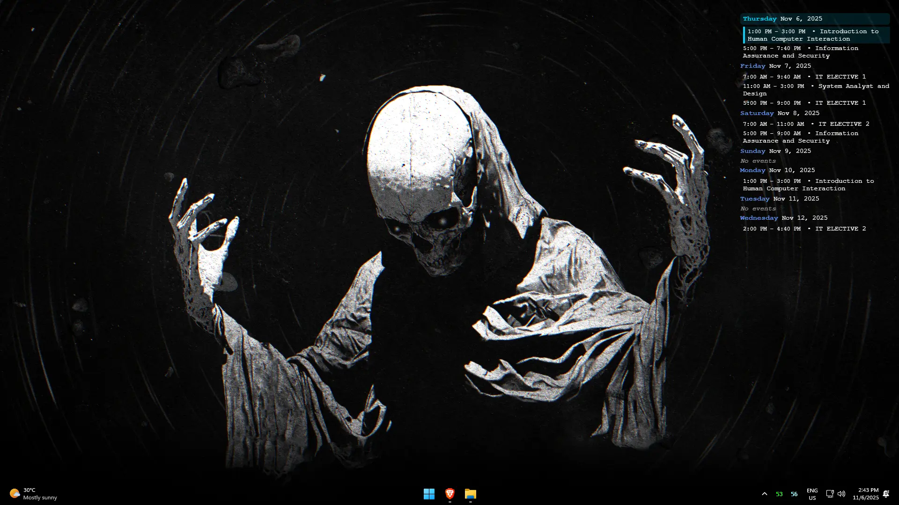
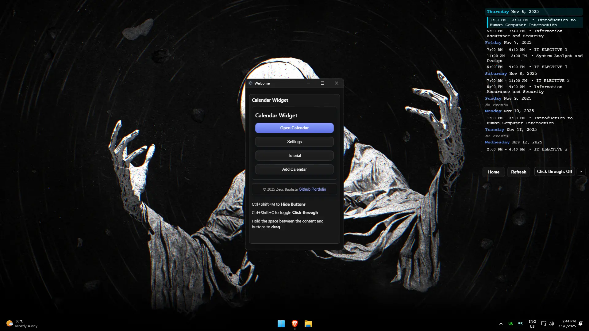
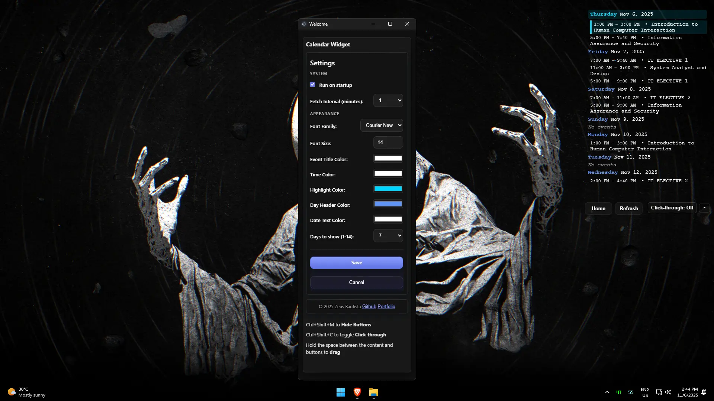
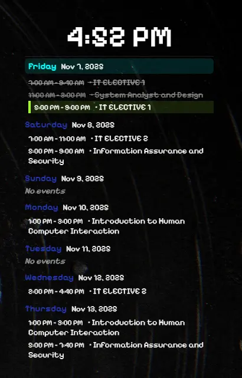
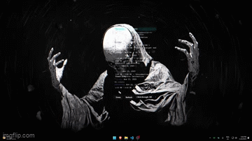

# 🗓️ Calendar Widget

A sleek and lightweight **Windows Calendar Widget** seamlessly connected to **Google Calendar** — without relying on any external databases or APIs.  
>All your data stays **private** and **securely stored locally**.

---
### 📦 Download

> You can always grab the most recent version directly from the **Releases** page.

---

## ✨ Features

- 💾 **Local Storage Only** – No external database or cloud dependency.  
- 🖋️ **Fully Customizable** – Change text size, font, and color to match your setup.  
- 🚀 **Launch on Startup** – Always there when you boot up.  
- 📅 **Up to 14 Days of Schedule** – View upcoming events at a glance.  
- 🖱️ **Draggable Widget** – Move it anywhere on your screen.  
- 📍 **Remembers Position** – Automatically restores its last position.  
- 🪟 **Click-Through Mode** – Interact with apps underneath while keeping it visible.  
- 🔻 **Always Below Apps** – Non-intrusive and distraction-free.

---

## 💡 Why I Built This

I often found myself **opening Google Calendar or checking my phone** just to see my next schedule.  
I wanted something that’s **always visible**, **minimal**, and **instantly accessible** — right on my desktop.  
That’s how this widget was born.

---

### ⌨️ Keybinds

| Shortcut | Action |
|:----------:|:----------------------------|
| <kbd>Ctrl</kbd> + <kbd>Shift</kbd> + <kbd>M</kbd> | Hide Buttons |
| <kbd>Ctrl</kbd> + <kbd>Shift</kbd> + <kbd>C</kbd> | Toggle Click-Through Mode |

---

## 🖼️ Screenshots

### 📆 Calendar Example
- Font Size: 14
- Font: Courier New

---

### 🏠 Home  
> This window remains hidden most of the time.  
> It only appears when you open it from the **tray icon** or the **home button** under the calendar.  

---

### ⚙️ Settings  
> - Change any text color  
> - Adjust text size (1–20)  
> - Choose from a limited but growing list of fonts  

---

### 🕰️ Clock
> - Adjustable Font Size
> - Adjsutable Text Size
> - 24h and 12h Time Format

 

---

### 🖼️ Previews

<table>
<tr>
<td align="center">
<b>🖱️ Draggable</b> 

</td>
<td align="center">
<b>🎨 Customizable</b> 

</td>
</tr>
</table>

---

# 📜 Custom MIT License  

Copyright (c) 2025 Zeus Angelo Bautista

    	Permission is hereby granted, free of charge, to any person obtaining a copy
    of this software and associated documentation files (the "Software"), to deal
    in the Software without restriction, including without limitation the rights
    to use, copy, modify, merge, publish, distribute, sublicense, and/or copy
    the Software, subject to the following conditions:

    1. The Software may not be sold or included in any commercial product or
       service. 
    2. If you modify, redistribute, or reuse any part of this Software, you must
       give clear credit to the original author: <b>Zeus Angelo Bautista</b>. 
    3. The above copyright notice and this permission notice shall be included
       in all copies or substantial portions of the Software.

    	THE SOFTWARE IS PROVIDED "AS IS", WITHOUT WARRANTY OF ANY KIND, EXPRESS OR
    IMPLIED, INCLUDING BUT NOT LIMITED TO THE WARRANTIES OF MERCHANTABILITY,
    FITNESS FOR A PARTICULAR PURPOSE AND NONINFRINGEMENT. IN NO EVENT SHALL THE
    AUTHORS OR COPYRIGHT HOLDERS BE LIABLE FOR ANY CLAIM, DAMAGES OR OTHER
    LIABILITY, WHETHER IN AN ACTION OF CONTRACT, TORT OR OTHERWISE, ARISING FROM,
    OUT OF OR IN CONNECTION WITH THE SOFTWARE OR THE USE OR OTHER DEALINGS IN
    THE SOFTWARE.

